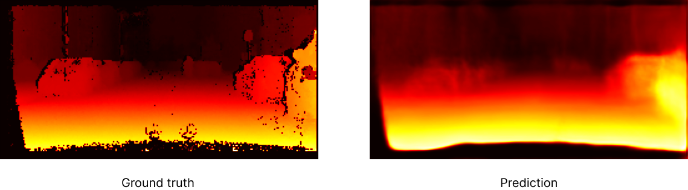

# Monocular Depth Estimation


## 📋 Table of Contents

- [Introduction](#introduction)
- [Installation](#installation)
- [Usage](#usage)
- [Documentation](#documentation)

## 🚀 Introduction
This project uses Convolutional Neural Networks (CNNs) for monocular depth 
estimation with [The Cityscapes Dataset](https://www.cityscapes-dataset.com/). 
The main architecture is [UNet3+](https://arxiv.org/abs/2004.08790),with the backbone sourced from 
the [timm library](https://github.com/huggingface/pytorch-image-models), known for 
its effectiveness in semantic segmentation tasks. We leverage 
[PyTorch Lightning](https://www.pytorchlightning.ai/index.html) to streamline model 
training and reduce boilerplate code, and employ custom logger callbacks 
for real-time performance tracking.





## 🛠 Installation

Step-by-step guide on how to install and set up your project. If there are different options for installation, make sure to include all of them.

```bash
pip install -r requirements.txt
```

## 💡 Example Usage
For the exemplary usage please refer to the [notebook](notebooks/usage.ipynb).

## 📚 Documentation
Here you find the [full documentation](https://mikikrus.github.io/monocular-depth-estimation/) of the project.